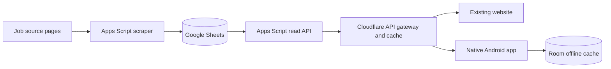
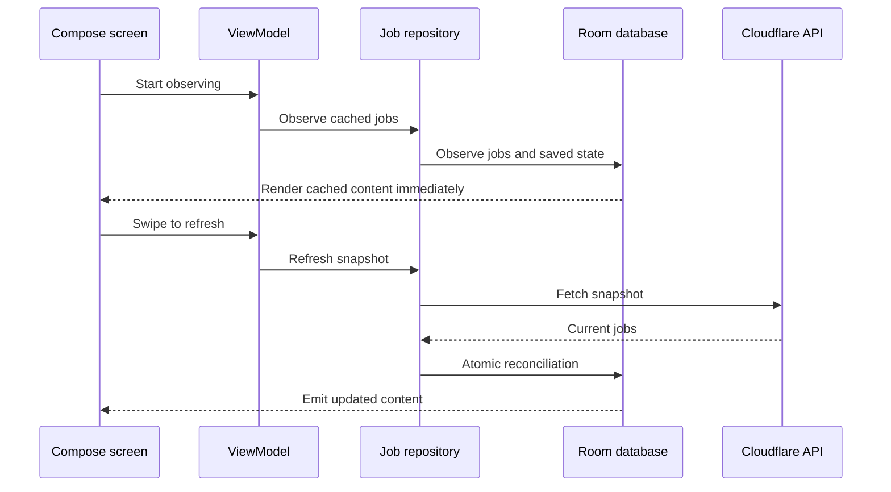

# GovJob India Android App — Architecture and Delivery Plan

## 1. Confirmed scope

Build a native Android application under `android-app/` using Kotlin and Jetpack Compose.

Included:

- Package/application ID: `com.govjobindia.app`
- Minimum Android SDK: 26
- Home job feed
- Search by title, keyword, board, and other job text
- Filters matching the website: qualification, state, recruitment board, and closing month
- Sorting matching the website: nearest deadline first and farthest deadline first
- Full details using every displayable field currently exposed and displayed by the website
- Official application, notification, website, and source links
- Local Saved jobs
- Offline Room cache
- Manual retry and swipe-to-refresh
- Skeleton UI for cold loading and refresh states
- Responsive layouts across supported phone sizes, font scales, orientations, and system insets
- A release APK copied to `build/`
- Source commit and GitHub Release publication when repository authentication and permissions are available

Excluded:

- Alerts or notifications
- Profile or accounts
- Login or registration
- Comments, likes, followers, or other social functionality
- Data fields or user-facing claims not supplied by the existing API, except local UI state such as Saved status and cache freshness
- Backend changes unless an existing API defect blocks correct app behavior

## 2. Existing system and integration boundary

The current pipeline remains unchanged:



The Android app will call only the public Cloudflare origin:

- `GET https://govjob-india.pages.dev/api/snapshot`
- `GET https://govjob-india.pages.dev/api/job_details?id={jobId}`
- `GET https://govjob-india.pages.dev/api/meta` when useful for freshness checks

The private Apps Script deployment URL, spreadsheet ID, and any backend configuration will never be embedded in the APK.

## 3. Android architecture

Use a single Gradle application module for the first production version. Organize it by layers and features so it can be modularized later without premature build complexity.

```text
android-app/
  app/
    src/main/java/com/govjobindia/app/
      core/
        database/
        model/
        network/
        designsystem/
        util/
      data/
        local/
        remote/
        mapper/
        repository/
      domain/
        repository/
      feature/
        jobs/
        search/
        saved/
        details/
      navigation/
      MainActivity.kt
      GovJobApplication.kt
    src/test/
    src/androidTest/
  gradle/
  build.gradle.kts
  settings.gradle.kts
  gradle.properties
  gradlew
  gradlew.bat
  README.md
```

### Technology choices

- Kotlin
- Jetpack Compose and Material 3
- Navigation Compose
- ViewModel plus immutable UI state and StateFlow
- Retrofit and OkHttp
- Kotlin serialization
- Room
- Hilt dependency injection
- Coroutines and Flow
- Coil only if remote imagery is later required; omit it initially because the API does not supply images
- JUnit, coroutine test utilities, Room tests, MockWebServer, and Compose UI tests

### Data flow



Room is the source of truth. Screens observe database flows and do not render directly from transient network responses. This prevents blank screens during refresh and makes cold/offline behavior deterministic.

## 4. Data contracts and persistence

### Remote job summary

Map all fields exposed by the backend job projection:

- `id`
- `title`
- `board`
- `qualification`
- `lastDate`
- `source`
- `url`
- `state`
- `postCount`
- `location`

### Remote job details

Map all fields exposed by the backend detail projection:

- `url`
- `html` for contract compatibility, but do not render arbitrary HTML
- `companyName`
- `postName`
- `noOfPosts`
- `advtNo`
- `salary`
- `qualification`
- `ageLimit`
- `startDate`
- `lastDate`
- `officialWebsite`
- `officialWebsites`
- `eligibility`
- `desirableSkills`
- `experience`
- `salaryDetails`
- `importantDates`
- `importantDatesTable`
- `selectionProcess`
- `generalInstructions`
- `howToApply`
- `importantLinks`
- `officialNotificationStatus`

### Room tables

1. `jobs`
   - Summary fields
   - `isActiveInLatestSnapshot`
   - Local update timestamp

2. `job_details`
   - Details payload normalized or serialized where appropriate
   - Fetch timestamp
   - Foreign key/job ID

3. `saved_jobs`
   - Job ID
   - Saved timestamp

4. `sync_metadata`
   - Last successful sync timestamp
   - Last attempted sync timestamp
   - Remote dataset version when available
   - Last non-sensitive error classification

Snapshot reconciliation must occur in one Room transaction. Missing server jobs are removed only when they are not Saved; Saved jobs remain available with a locally clear unavailable/expired state based solely on known data.

## 5. Navigation and UI

Use three bottom-navigation destinations:

1. Home
2. Search
3. Saved

Job Details is a nested destination outside the bottom bar. Returning from Details restores list scroll position, active filters, search text, and sort order.

The SVG mockup is visual guidance only. Compose code, Material accessibility requirements, actual data density, and adaptive constraints are authoritative.

### Home

- Compact branded top app bar
- Search shortcut
- Job-count and cache freshness context
- Lazy vertical feed
- Cards containing only API-backed summary information
- Save control
- Clear last-date treatment
- Pull-to-refresh container
- Skeleton cards when no cache exists
- Existing cached cards remain visible with a lightweight refresh indicator during refresh

### Search

- Debounced local full-text search over the cached API-backed fields
- State, qualification, board, and month filters
- Nearest/farthest date sort
- Active-filter count
- Filter bottom sheet on narrow screens
- Expanded side/filter layout only when sufficient width makes it useful
- Clear-all action
- Empty state that distinguishes no matches from no cached data

### Saved

- Local-only list of Saved jobs
- Same job-card component as Home
- Unsave action with accessible feedback
- Clear explanation when empty
- No invented reminders or notification behavior

### Details

- Summary header and source/board information
- Company, post name, vacancies, advertisement number, salary, qualification, location, and age limit
- Important links restricted to valid HTTP or HTTPS URLs and allowed backend link types
- Start date, last date, and important dates with duplicate suppression consistent with the website
- Salary/stipend details
- Eligibility
- Desirable skills/essential requirements
- Experience
- Selection process
- General instructions
- How to apply
- Source link
- Save action
- Retry state if details are absent and the network request fails
- Cached details shown while a refresh/retry error is communicated non-destructively

Sections with no values are omitted, matching the website behavior rather than showing fabricated placeholders throughout.

## 6. Responsive and accessibility requirements

- All screens use `Scaffold`, system bar insets, and IME insets correctly
- No fixed screen widths or heights for content containers
- Cards use width constraints and wrap content vertically
- Text uses max lines and ellipsis only where losing hidden text does not remove critical information
- Full critical information remains available in Details
- Use `LazyColumn`, adaptive padding, and window-size-aware constraints
- Support portrait and landscape without overlap
- Support compact phones down to practical SDK-supported widths
- Support large phones, foldable widths, and tablets without stretching text to unreadable line lengths
- Support font scales through at least 200 percent without clipped controls
- Buttons enforce minimum touch targets and use wrapping or adaptive stacking
- Bottom navigation labels and icons remain within safe bounds
- Loading, empty, error, and offline states are announced accessibly
- Every icon-only action has a content description
- Color is never the only deadline/status signal
- Light and dark themes maintain contrast
- Avoid nested vertical scrolling

## 7. Refresh, caching, and state behavior

### Cold start with no cache

- Show skeleton cards
- Fetch snapshot
- Persist and render on success
- Replace skeletons with a full-screen retry state on failure

### Warm start with cache

- Render cache immediately
- Show last-updated context
- Refresh without hiding content
- On failure, preserve cached content and show a retry Snackbar/banner

### Pull-to-refresh

- Trigger only one refresh at a time
- Respect cancellation and ViewModel lifecycle
- Keep indicator until the repository operation reaches a terminal state
- Prevent repeated pull gestures from creating concurrent requests
- Announce completion or failure accessibly

### Job details

- Show cached details immediately when available
- Fetch when absent
- Allow explicit retry
- Do not issue duplicate requests during recomposition or rapid repeated taps
- Validate that the response belongs to the requested job context

### Saved data

- Save/unsave operations work offline
- Saved state appears consistently in Home, Search, Saved, and Details
- Snapshot replacement does not erase Saved state

## 8. Edge cases to handle

### Network and API

- No connectivity, DNS failure, timeout, TLS failure, non-2xx response, malformed JSON, empty body
- Backend returns HTTP success with an `error` field
- Snapshot contains zero jobs
- Partial or null optional fields
- Unexpected additional JSON fields
- Duplicate job IDs
- Duplicate important links or dates
- Very large snapshot
- Slow response while user navigates away
- Process death during refresh
- API rate limiting or temporary backend failure

### Data

- Invalid or missing date
- Expired date
- Unusually long title, board, qualification, or detail item
- Missing state/location
- Missing post count or nonnumeric source value
- Details missing although summary exists
- Job removed from the latest snapshot while locally Saved
- Detail arrays containing blank, repeated, or object-shaped date entries
- Invalid, non-HTTP, or unsafe external URLs

### UI and lifecycle

- Rapid navigation and double taps
- Configuration changes
- Process recreation
- Keyboard covering search controls
- Large font and display scaling
- TalkBack traversal
- Gesture and three-button navigation insets
- Empty search and whitespace-only search
- Filters whose selected value disappears after sync
- Rotation while filter sheet or details is open
- Refresh while search/filter results are active

## 9. Security and privacy

- Request only Android internet/network-state permissions
- No contacts, storage, location, notification, or identity permissions
- HTTPS-only API base URL
- No private Apps Script URL in source or APK
- No arbitrary WebView
- External links opened using a browser/custom tab and checked for HTTP or HTTPS
- No cleartext traffic
- Release minification and resource shrinking enabled after serialization/Room rules are verified
- Keystore and signing properties generated locally and ignored by Git
- No secrets in Gradle files, source control, APK metadata, logs, or GitHub Release notes
- Do not log complete payloads or sensitive URLs in release builds

## 10. Testing and quality gates

### Unit tests

- DTO-to-domain and entity mappings
- Date parsing/display and deadline status
- Search normalization
- Every filter and sort mode
- Details date deduplication
- Safe-link validation and important-link filtering
- Repository cache/network decision behavior
- Saved reconciliation

### Database tests

- Snapshot transaction
- Saved job preservation
- Cascades and migrations
- Details upsert
- Flow emissions

### Network tests

- Successful snapshot/details/meta responses
- Error object in a successful HTTP response
- Malformed and partial payloads
- Timeout and HTTP errors
- Unknown fields

### Compose tests

- Loading, content, empty, offline, and error states
- Search/filter/sort interaction
- Save/unsave consistency
- Pull-to-refresh trigger and concurrency guard
- Details sections and external-link actions
- Bottom navigation and back-stack restoration

### Responsive checks

- Multiple emulator widths and heights
- Portrait and landscape
- Font scales including 200 percent
- Light and dark themes
- Gesture and three-button navigation
- Screenshot/manual checks for clipping, overlap, and overflow

### Build gates

- Debug build succeeds
- Unit tests pass
- Android lint passes
- Release build succeeds with minification
- APK installs on an API 26 emulator/device and a current API emulator/device
- Core smoke flow passes: launch, refresh, search, filter, sort, open details, open valid source, save, view Saved, relaunch offline

## 11. Build, signing, artifact, and release

1. Add Android and signing outputs to the root ignore rules.
2. Generate a local upload/release keystore outside tracked source or under an ignored secure local path.
3. Read signing values from an ignored local properties file or environment variables.
4. Produce the signed release APK.
5. Verify its signature and package ID.
6. Copy the final APK to `build/govjob-india-v1.0.0.apk`.
7. Add checksums and build metadata to `build/README.md` without exposing signing information.
8. Commit source, wrapper, plan, tests, documentation, and the requested distributable APK.
9. Push the branch to the configured GitHub remote.
10. If authenticated GitHub tooling and repository permission are available, create tag `v1.0.0`, publish a GitHub Release, and attach the APK plus checksum.
11. If release publication is blocked by missing authentication/permission, leave the repository committed with the verified APK ready and report the exact blocked release step without exposing credentials.

## 12. Ordered implementation checklist

- [ ] Inspect local Android/JDK/Gradle/Git/GitHub tooling and repository remote before choosing compatible plugin versions.
- [ ] Scaffold `android-app/` with Gradle wrapper, version catalog or centralized dependency declarations, application module, package namespace, SDK 26 minimum, and release build configuration.
- [ ] Update root ignore rules for Android intermediates, IDE state, local SDK paths, signing properties, and keystores while intentionally allowing the final `build/` release artifact requested by the project.
- [ ] Add app manifest, network security posture, themes, typography, color system, launcher resources, and adaptive icon.
- [ ] Implement nullable tolerant API DTOs and Retrofit endpoints for snapshot, details, and metadata against the public Cloudflare base URL.
- [ ] Implement domain models and explicit mappers so remote, local, and UI contracts remain separated.
- [ ] Implement Room entities, relations, converters, DAOs, database, transactional snapshot reconciliation, details caching, Saved state, and sync metadata.
- [ ] Implement repository flows and refresh/details operations with structured error mapping, request deduplication, cancellation safety, and offline-first behavior.
- [ ] Implement dependency injection for networking, persistence, repository, dispatchers, and test replacements.
- [ ] Implement reusable responsive components: app bars, job cards, chips, skeleton cards, empty/error/offline states, safe external-link handling, and adaptive action groups.
- [ ] Implement Home with cached feed, skeleton cold load, non-destructive refresh, swipe-to-refresh, retry, Saved control, deadline display, and stable list keys.
- [ ] Implement Search with normalized query, state/qualification/board/month filters, date sorting, filter bottom sheet, clear-all, result count, and state restoration.
- [ ] Implement Saved with Room-backed local bookmarks, unavailable-job handling, shared cards, empty state, and offline behavior.
- [ ] Implement Details with all website-visible backend fields, loading skeleton, cached rendering, retry, duplicate suppression, omitted empty sections, Saved state, and safe official/source actions.
- [ ] Implement Navigation Compose with three bottom destinations, detail routing by stable ID, state restoration, deep-link-safe argument handling, and correct back behavior.
- [ ] Add light/dark themes, accessibility semantics, large-font resilience, system/IME insets, and adaptive layouts; validate that controls never overlap or overflow.
- [ ] Add mapper, filter, sort, repository, database, network-contract, and edge-case unit tests.
- [ ] Add Compose UI tests for navigation, states, refresh, search, filters, Saved, Details, and responsive rendering.
- [ ] Run formatting/static checks, unit tests, Android lint, debug build, and release build; resolve all actionable failures.
- [ ] Perform emulator/device smoke tests on API 26 and a current API, including offline relaunch and extreme font/display settings.
- [ ] Generate and securely configure a local untracked release keystore, build and verify the signed APK, and copy it to `build/govjob-india-v1.0.0.apk` with checksum documentation.
- [ ] Update project documentation with architecture, setup, API usage, cache behavior, build commands, signing instructions, limitations, and release process.
- [ ] Review tracked files for secrets and unwanted build products, then commit the complete implementation with a descriptive commit message.
- [ ] Push to GitHub and publish tag/release `v1.0.0` with the verified APK and checksum when authenticated permissions are available; otherwise record the precise publication blocker.

## 13. Acceptance criteria

- The app uses the same Cloudflare API as the website and never accesses private backend resources.
- All website-visible job summary and detail information is represented when supplied by the API.
- No unsupported backend-derived feature or fabricated job information appears.
- Cached jobs launch and remain usable offline.
- Pull-to-refresh works without duplicate concurrent requests or blanking cached content.
- Saved jobs work locally and consistently across screens without login.
- Search, filters, and sorting match website semantics.
- Empty, loading, refreshing, stale-cache, malformed-data, and failure states are intentional and recoverable.
- No buttons, text, cards, sheets, navigation items, or system bars overlap or overflow under the tested responsive configurations.
- The release APK is signed with an untracked keystore, verified, copied to the root `build/` folder, and ready for installation.
- Repository commit and GitHub Release publication are completed when local authentication and permissions permit them.
